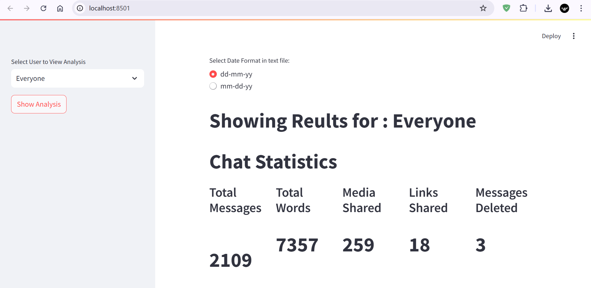

# whatsapp-chat-analysis
Unlock fascinating insights from your WhatsApp chats with just one export! This tool analyzes your conversations, revealing trends through interactive graphs, word clouds, and emoji breakdowns. Whether it's a group chat or a one-on-one convo, discover patterns and stats you never noticed before!



## Overview
The **WhatsApp Chat Analyzer** is a tool designed to extract and visualize insights from WhatsApp chat exports. With just a text file of your chat, you can explore statistics, word clouds, emoji analysis, and more.

## Features
- **Chat Data Extraction** – Extract timestamps, senders, and message content from WhatsApp chat exports.
- **Participant Analysis** – Analyze individual activity, message count, average message length, and active hours.
- **Chat Statistics** – Get insights on total messages, media messages, and the most active days/times.
- **Word Cloud Generation** – Visualize frequently used words in your chats.
- **Emoji Analysis** – Identify and analyze the most used emojis.
- **Interactive Visualizations** – View interactive graphs and plots to uncover trends.

## Installation
1. Install dependencies:
   ```shell
   pip install -r requirements.txt
   ```
2. Run the app:
   ```shell
   streamlit run main.py
   ```
   This will start the app in your local environment.

## Usage
1. **Export Your WhatsApp Chat:**
   - Open WhatsApp and navigate to the chat you want to analyze.
   - Export the chat as a text file (instructions available on WhatsApp's official website).
2. **Run the App Locally:**
   - Follow the installation steps above.
3. **Upload Your Chat File:**
   - Use the app interface to upload the exported text file.
4. **Explore the Analysis:**
   - Choose different analysis options and visualize your chat insights.

## Examples
- Analyze group chat statistics over a specific period.
- Generate a word cloud to see frequently used words.
- View participant activity and emoji usage trends.

## Disclaimer
> This project is developed for learning purposes. 

Happy analyzing!

